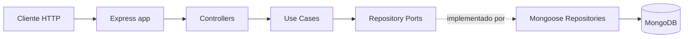

# Relatório técnico — gp-api (Garden / Cultivo)

**Escopo:** API REST para jardins, logs de cultivo e estoque.  
**Objetivo do documento:** Fonte de verdade para NotebookLM e fechamento do projeto.  
**Data de referência do ambiente:** 18/04/2026.

---

## 1. Visão geral da arquitetura

### 1.1 Stack tecnológico

| Camada | Tecnologia |
|--------|------------|
| Runtime | Node.js (Dockerfile: **Node 20 Alpine**) |
| HTTP | **Express 5.2.x** |
| Persistência | **MongoDB** via **Mongoose 9.2.x** |
| Config | **dotenv** |
| CORS | **cors** (middleware global) |
| Dev | **nodemon** |

**Scripts:** `start` (produção), `dev` (nodemon), `seed` (popular/limpar dados).

### 1.2 Organização modular e responsabilidades

O README e o código descrevem uma **arquitetura em camadas inspirada em Clean Architecture**, com fluxo explícito:

**HTTP → Rotas → Controllers → Casos de uso → Ports (interfaces) → Repositórios Mongoose → MongoDB → Resposta JSON**

| Pasta / módulo | Responsabilidade |
|----------------|------------------|
| `src/server.js` | Carrega `.env`, conecta ao MongoDB, sobe o listener HTTP. |
| `src/app.js` | Monta Express: CORS, `express.json()`, `/health`, `/api` (descoberta de endpoints), rotas `/api/gardens`, `/api/logs`, `/api/inventory`, 404, middleware de erro. |
| `src/config/database.js` | `mongoose.connect` usando `MONGO_URI` ou fallback `mongodb://localhost:27017/growapp`. |
| `src/domain/` | Tipos JSDoc e fábricas simples (`createGarden`, `createLog`, `createInventoryItem`); erros de aplicação (`NotFoundError`, `ValidationError`, `DomainError`). Sem I/O. |
| `src/application/ports/` | Contratos de repositório (classes base com métodos não implementados). **Repository pattern / ports & adapters.** |
| `src/use-cases/` | Um arquivo por caso de uso (listar, obter, criar, atualizar, deletar, plantas aninhadas, low-stock). Dependem apenas das ports. |
| `src/infrastructure/repositories/` | Implementações **Mongo/Mongoose** das ports (`GardenRepositoryMongo`, `LogRepositoryMongo`, `InventoryRepositoryMongo`). |
| `src/infrastructure/container.js` | **Composition root:** instancia repositórios e injeta nos casos de uso; exporta objetos prontos para os controllers. |
| `src/infrastructure/errorMiddleware.js` | Traduz erros de domínio e Mongoose para status HTTP e JSON. |
| `src/models/` | Schemas Mongoose, enums, índices. |
| `src/controllers/` | Adaptam `req`/`res` para DTOs simples e chamam o `container`. |
| `src/routes/` | Express Router por agregado; **gardens** também encaminha `GET /:id/logs` para o controller de logs. |
| `src/seed/` | Script que **apaga todas as coleções** e reinsere mocks (`mockData.js`). |

### 1.3 Fluxo de dados principal (por agregado)

1. **Jardins (`gardens`)**  
   Identificador de negócio: campo string **`id`** (não é o `_id` do Mongo). CRUD + sub-recurso **plantas** embutidas no documento do jardim (`plants[]`). Listagem com filtros `phase`, `environment` e paginação `limit`/`skip`.

2. **Logs (`logs`)**  
   Coleção própria com `gardenId` string. Listagem filtra por `gardenId`, `type`, intervalo de datas, paginação. **Leitura/atualização/remoção por `_id` do Mongo** (`GetLogById`, `findById` / `findByIdAndUpdate` / `findByIdAndDelete`).

3. **Estoque (`inventory`)**  
   Identificador de negócio string **`id`**, similar a jardins. Rota dedicada `GET /low-stock` antes de `/:id` (ordem correta).

### 1.4 Padrões de design observados

- **Clean Architecture (parcial):** separação domínio / aplicação / infra / interface HTTP está presente e documentada.  
- **Repository pattern + inversão de dependência:** casos de uso dependem de classes `*Repository` abstratas; Mongoose fica só na infra.  
- **Use case por classe:** um comando por arquivo, construtor com injeção do repositório.  
- **Composition root:** `container.js` centraliza wiring (sem DI container de terceiros).  
- **Não é event-driven:** fluxo síncrono request/response; sem filas, webhooks ou domínio orientado a eventos.  
- **Documentação embutida:** `GET /api` devolve JSON descrevendo endpoints (substituto leve de OpenAPI).

### 1.5 Infraestrutura e deploy

- **`docker-compose.yml`:** serviços `mongo` (imagem oficial 7, volume, healthcheck) e `api` (build local, `MONGO_URI` apontando para o host `mongo`).  
- **`Dockerfile`:** `npm install --omit=dev`, copia `src`, `NODE_ENV=production`, `CMD npm run start`.  
- **`.env.example`:** apenas `PORT` e `MONGO_URI` (sem segredos commitados). **`.gitignore` ignora `.env`.**

---

## 2. Auditoria de vulnerabilidades e débito técnico

### 2.1 Segurança (AppSec)

**Crítico — superfície pública sem autenticação/autorização**

- Não existe middleware de **JWT, sessão, API key** ou qualquer controle de identidade. Qualquer cliente que alcance a API pode **ler, criar, alterar e apagar** jardins, logs e estoque.  
- O repositório não implementa auth no código da aplicação (há menções apenas em documentação auxiliar, ex.: `ANALISE_GP_API.md`).

**Alto — CORS permissivo**

- `app.use(cors())` sem opções: em cenários com credenciais/browser, o padrão do pacote `cors` ainda é relevante; para API pública reflete **falta de política explícita** de origens e reforça que a API foi pensada como ambiente fechado/dev, não endurecido.

**Alto — ausência de camadas de endurecimento HTTP**

- Sem **Helmet** (headers de segurança), **rate limiting**, **limite explícito de tamanho de body** em `express.json()` (risco de consumo de memória/DoS com payloads grandes).  
- Sem **validação de entrada estruturada** (ex.: Zod/Joi) na borda HTTP: o corpo da requisição vai direto aos casos de uso de **create/update** que apenas repassam ao repositório.

**Médio — validação concentrada no Mongoose, não no domínio**

- Casos de uso como `CreateGarden`, `CreateLog`, `CreateInventoryItem` são **anêmicos** (delegam 100% ao persistence layer).  
- Há validação útil nos schemas (enums `phase`, `environment`, `LOG_TYPES`, números não negativos em estoque, etc.), mas isso **não substitui** regras explícitas de negócio (ex.: obrigatoriedade de `gardenId` em log já está no schema; porém **atualizações parciais** podem contornar expectativas se o cliente enviar combinações estranhas de campos).  
- **`ValidationError` e `DomainError` do domínio** existem em `errors.js` e são exportados em `domain/index.js`, mas **nenhum caso de uso analisado lança `ValidationError` ou `DomainError`** — a camada de domínio de “erros ricos” está subutilizada frente ao Mongoose.

**Médio — vazamento de informação em erros 500**

- Em `errorMiddleware.js`, para erros não mapeados, a resposta usa `err.message` genérico. Dependências ou código futuro podem expor **detalhes internos** (mensagens de driver, paths, etc.). O ideal é mensagem genérica em produção e log estruturado no servidor.

**Médio — script de seed destrutivo**

- `seed.js` executa `deleteMany({})` em **todas** as coleções antes de inserir mocks. Em ambiente mal configurado (URI de produção), isso é **perda total de dados**. Não há guarda (`NODE_ENV`, confirmação, allowlist de host).

**Baixo a médio — MongoDB exposto no compose**

- `docker-compose` publica `27017:27017` no host: aceitável para desenvolvimento local; **inaceitável como padrão de produção** sem autenticação Mongo e firewall.

**Baixo — consistência de identificadores**

- **Logs** usam `_id` Mongo nas rotas REST; **jardins e estoque** usam `id` string de negócio. Isso não é vulnerabilidade por si só, mas aumenta risco de **confusão de cliente** e de políticas de autorização futuras (“quem pode acessar este ObjectId?”).

**Sanitização / XSS**

- API JSON pura; não há templates HTML. Risco de XSS é **baixo no backend**; campos de texto livre (`note`, etc.) podem carregar conteúdo malicioso que afeta **frontends** se renderizados sem escape (responsabilidade do cliente).

**Segredos em repositório**

- Não foram encontrados padrões de senhas/API keys hardcoded no `src` (além de ausência de auth). `.env` está ignorado; `.env.example` contém apenas placeholders locais — **adequado**.

### 2.2 Performance

**Paginação**

- `limit`/`skip` são parseados com `parseInt` nos casos de uso de listagem e só aplicados se inteiros válidos — evita strings inválidas virarem `0` de forma perigosa; valores inválidos resultam em **sem limite** (listas completas). Em coleções grandes, isso é **gargalo de memória e latência**.

**Consultas**

- Índices definidos em `Garden` (`phase`, `environment`, `startDate`), `Log` (`gardenId`+`date`, `type`), `InventoryItem` (`name`, `category`) — **positivo** para filtros comuns.  
- **Low stock** usa `$expr: { $lte: ["$quantity", "$minStock"] }` sem índice composto dedicado; volume moderado é ok, em escala pode exigir **materialized view**, campo derivado ou índice parcial conforme padrão de dados.

**Padrão N+1 / round-trips**

- Operações de planta carregam o jardim inteiro, alteram subdocumentos e `save()` — adequado ao modelo de documento único; não há loop de queries por planta.

**Caching**

- Nenhum cache (Redis, HTTP cache, ETag). Para API de leitura frequente, é **melhoria**, não bug, desde que a latência do Mongo seja aceitável.

**Log repository — `try/catch` que engole erros**

- `findByMongoId`, `update` e `delete` em `LogRepositoryMongo` retornam `null`/`false` em `catch` sem log — pode mascarar **falhas transitórias** ou corrupção e devolver 404 em vez de 503.

### 2.3 Code smell e SOLID

- **S — Single Responsibility:** controllers finos; casos de uso focados — bom.  
- **O — Open/Closed:** novos repositórios exigem nova classe + wiring no `container` — esperado.  
- **L — Liskov:** implementações de repositório honram os contratos.  
- **I — Interface Segregation:** ports de repositório são interfaces “gordas” por agregado — aceitável para o tamanho do projeto.  
- **D — Dependency Inversion:** respeitado entre use cases e ports.

**Cheiros específicos**

1. **Casos de uso de criação/atualização sem política:** violam a intenção de “domínio rico” da Clean Architecture; o domínio real está nos **schemas Mongoose**, acoplando regras de negócio à persistência.  
2. **`DomainError` / `ValidationError` de aplicação subutilizados** frente ao middleware que já os suporta parcialmente.  
3. **Controllers acoplados ao `container` singleton** — simples, mas dificulta testes unitários sem mock de módulo.  
4. **Duplicação de lógica de conexão** entre `database.js` e `seed.js` (URI default repetida).

---

## 3. Backlog técnico e próximos passos (Production Ready)

### 3.1 Críticas (segurança / core)

1. **Implementar autenticação e autorização** (ex.: JWT com refresh + claims mínimos, ou OAuth2/API Gateway; associar `gardenId`/recursos ao `sub` do token).  
2. **Restringir CORS** a origens conhecidas; definir política para credenciais.  
3. **Rate limiting** e **limite de body** (`express.json({ limit: '...' })`).  
4. **Helmet** (ou equivalente no reverse proxy) + **HTTPS** obrigatório em produção.  
5. **Endurecer erros 500:** mensagem fixa ao cliente, detalhe só em logs (correlation id).  
6. **Proteger o seed:** variável de ambiente `ALLOW_SEED=true`, bloqueio se `NODE_ENV === 'production'`, ou comando separado nunca deployado.  
7. **Mongo em produção:** autenticação, TLS, rede privada, **não** expor `27017` publicamente.  
8. **Validação na borda:** schema de request (Zod/Joi) alinhado aos DTOs públicos; rejeitar campos desconhecidos onde fizer sentido.

### 3.2 Funcionais (features / plataforma)

1. **OpenAPI/Swagger** gerado e versionado (o `GET /api` é útil mas não substitui contrato formal nem codegen).  
2. **Testes automatizados:** não há script `test` no `package.json`; faltam testes de integração (supertest + Mongo em memória ou container) cobrindo rotas e erros.  
3. **Observabilidade:** logs estruturados (pino/winston), métricas (Prometheus), tracing opcional.  
4. **CI/CD:** pipeline que rode lint, testes e build da imagem.  
5. **Política de IDs:** decidir se logs também expõem `id` de negócio para consistência REST e futura migração.  
6. **Paginação obrigatória ou default seguro** em listagens para evitar full scan acidental.

### 3.3 Melhorias (UX de API / refatoração)

1. **HATEOAS leve ou links** na resposta de coleções (opcional).  
2. **ETag / If-None-Match** para GETs frequentes (ex.: lista de estoque).  
3. **Versionamento de API** (`/api/v1/...`).  
4. **Refatorar validação** para o domínio ou camada de aplicação, mantendo Mongoose como última linha de defesa.  
5. **Unificar tratamento de erro** no `LogRepositoryMongo` (log + rethrow ou erro tipado).  
6. **Healthcheck “deep”** opcional: checagem de Mongo além de `status: ok`.

---

## 4. Contexto para tomada de decisão (NotebookLM)

### 4.1 Por que a arquitetura atual faz sentido no código

- O projeto foi estruturado para **evoluir sem travar a persistência:** trocar Mongo por outro backend exigiria sobrescrever só `infrastructure/repositories` e o `container`, mantendo casos de uso.  
- **Mongoose como fonte de verdade da validação** acelera o MVP: enums e tipos no schema garantem integridade rápida, com custo de **menos regra explícita no domínio**.  
- **`id` string para jardins/estoque** sugere alinhamento com **IDs gerados no cliente ou no app mobile** (padrão comum em apps offline-first ou sync); **logs com `_id` Mongo** sugerem que logs são criados principalmente **server-side** ou que o cliente foi simplificado para usar o ID nativo do banco.  
- **`GET /api` como documentação** indica prioridade em **descoberta rápida** para desenvolvedores front-end sem pipeline de docs estático.

### 4.2 Dependências críticas e interação

- **Express** é o único framework HTTP; todo tráfego passa por ele.  
- **Mongoose** é a única camada de acesso a dados; índices e validações dependem dele.  
- **dotenv** só é carregado em `server.js` e `seed.js` — a app em Docker recebe env do Compose.  
- **cors** está no caminho global — qualquer política de browser passa por essa decisão.

### 4.3 Riscos aceitos implicitamente pelo código

- API tratada como **rede confiável** (sem auth).  
- **Integridade entre agregados** (ex.: log com `gardenId` inexistente) não é validada por referência no domínio — apenas formato/tipos onde o schema exige.  
- **Operações destrutivas** (DELETE, seed) sem barreiras adicionais.

### 4.4 O que declarar como “estado atual” para stakeholders

- Backend **funcional para protótipo ou intranet**, com **separação arquitetural sólida** e **persistência modelada com cuidado** (índices, enums).  
- Para **produção na internet**, o gap principal não é “falta de feature de negócio”, e sim **segurança, contrato formal da API, testes e operação** (monitoramento, backups, política de secrets).

---

## Resumo executivo

| Dimensão | Avaliação |
|----------|-----------|
| Arquitetura | Boa separação em camadas; Repository + use cases claros. |
| Segurança | **Inadequada para produção pública** (sem auth, CORS aberto, sem rate limit/helmet, erro 500 potencialmente verboso). |
| Validação | Forte no Mongoose; fraca na aplicação/domínio. |
| Performance | Adequada para volume pequeno/médio; listas sem limite default são o principal risco. |
| Operacional | Docker e seed úteis para dev; seed e Mongo exposto são riscos se mal usados em prod. |
| Testes / CI | **Ausentes** no pacote atual. |
